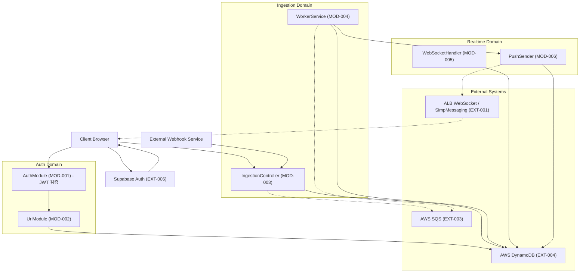
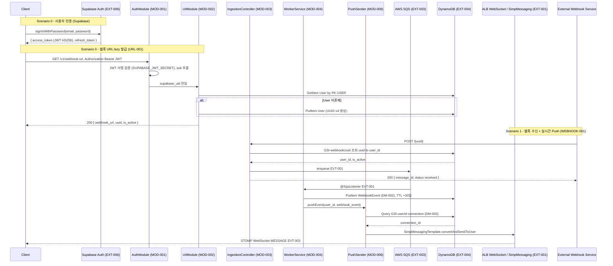
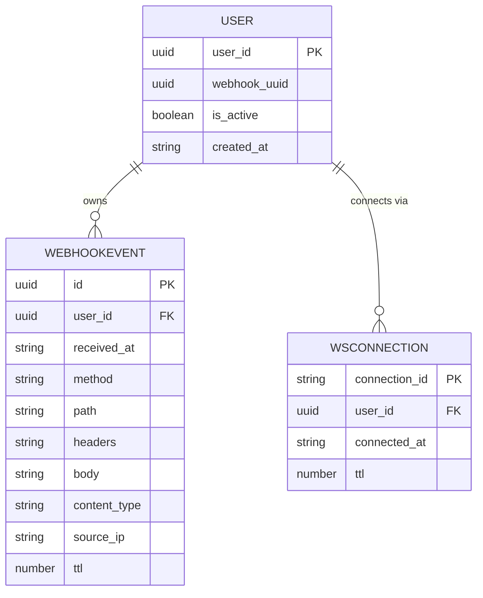

# 웹훅 인스펙터 Diagrams

## Overview

이 문서는 웹훅 인스펙터 시스템의 5종 Mermaid 다이어그램을 포함한다.
각 다이어그램은 ArchSpec(MOD/EXT/Deployment), APISpec(Endpoints/Scenarios), TechSpec(Data Models)을 기반으로 생성되었다.

| 다이어그램 | 타입 | 근거 문서 |
|-----------|------|---------|
| System Architecture | graph TD | ArchSpec Modules + Module Dependencies |
| API Sequence | sequenceDiagram | APISpec Endpoints + ArchSpec Data Flow Scenarios |
| Data Model (ERD) | erDiagram | TechSpec Data Models (DM-001~DM-003) |
| Pipeline Flow | flowchart TD | ArchSpec Data Flow Scenario 1 |
| Deployment Topology | graph LR | ArchSpec Deployment Topology |

---

## System Architecture

ArchSpec의 6개 모듈(MOD-001~MOD-006)과 외부 시스템(EXT-001, EXT-003, EXT-004, EXT-006 Supabase)을
Auth / Ingestion / Realtime 3개 도메인으로 subgraph 그룹화했다.
동기 호출(`-->`)과 비동기 이벤트(`-.->`)를 구분하여 표시한다.



---

## API Sequence

ArchSpec의 2개 핵심 시나리오를 시퀀스 다이어그램으로 표현한다.
- **Scenario 0**: 사용자 인증 + 웹훅 URL 최초 발급 (Supabase 로그인 → URL-001)
- **Scenario 1**: 웹훅 수신 + 실시간 대시보드 Push (WEBHOOK-001)



---

## Data Model (ERD)

TechSpec의 3개 Data Model(DM-001~DM-003)을 ERD로 표현한다.
DynamoDB 단일 테이블 설계이므로 엔티티 간 관계는 논리적 FK 참조를 의미한다.
USER 엔티티의 `user_id`는 Supabase Auth가 발급한 UID이며, 이메일·비밀번호 해시는 Supabase가 관리하므로 본 테이블에는 저장하지 않는다.



---

## Pipeline Flow

ArchSpec Scenario 1(웹훅 수신 → 저장 → 실시간 시각화)을 flowchart로 표현한다.

```mermaid
flowchart TD
    Start([외부 웹훅 POST 수신]) --> ValidUUID{UUID 유효?}
    ValidUUID -->|유효 + 활성| EnqueueSQS["SQS Main Queue enqueue (EVT-001)"]
    ValidUUID -->|무효 or 비활성| Return4xx[4xx 응답 반환]

    EnqueueSQS --> Return200[200 OK 즉시 응답]
    EnqueueSQS -.->|@SqsListener| WorkerConsume["WorkerService 소비 (MOD-004)"]

    WorkerConsume --> SaveEvent["DynamoDB 저장 WebhookEvent (DM-002), TTL +30일"]
    SaveEvent --> PushWS["WebSocket Push EVT-003 via MOD-006"]
    PushWS --> Done([실시간 대시보드 표시 완료])
```

---

## Deployment Topology

ArchSpec Deployment Topology 섹션의 모든 배포 단위를 AWS 인프라 경계별 subgraph로 표현한다.
Supabase Auth는 외부 SaaS이므로 AWS 외부에 별도 배치한다.

```mermaid
graph LR
    subgraph "Client Layer"
        Browser[Browser Dashboard]
        ExtWebhookSvc[External Webhook Service]
    end

    subgraph "External SaaS"
        SupabaseAuth["Supabase Auth\nJWT HS256 발급"]
    end

    subgraph "AWS CDN"
        CF[CloudFront]
        S3["S3 s3-dashboard"]
    end

    subgraph "AWS Load Balancer"
        ALB["alb-main\nALB + sticky session"]
    end

    subgraph "AWS Compute — Auto Scaling Group"
        EC2a["EC2 Instance 1\nSpring Boot 3.x / Java 21\nt3.micro"]
        EC2b["EC2 Instance 2\nSpring Boot 3.x / Java 21\nt3.micro"]
    end

    subgraph "AWS Queue"
        SQSMain["sqs-main\nSQS Standard"]
    end

    subgraph "AWS Storage"
        DynamoDB[("dynamodb-main")]
    end

    subgraph "AWS Monitoring"
        CW["cloudwatch-dash\nMetrics + CloudWatch Agent"]
    end

    Browser --> SupabaseAuth
    Browser --> CF
    CF --> S3
    Browser --> ALB
    ExtWebhookSvc --> ALB

    ALB --> EC2a
    ALB --> EC2b

    EC2a -->|enqueue| SQSMain
    EC2b -->|enqueue| SQSMain
    SQSMain -->|@SqsListener poll| EC2a
    SQSMain -->|@SqsListener poll| EC2b
    EC2a --> DynamoDB
    EC2b --> DynamoDB
    EC2a --> CW
    EC2b --> CW
```
